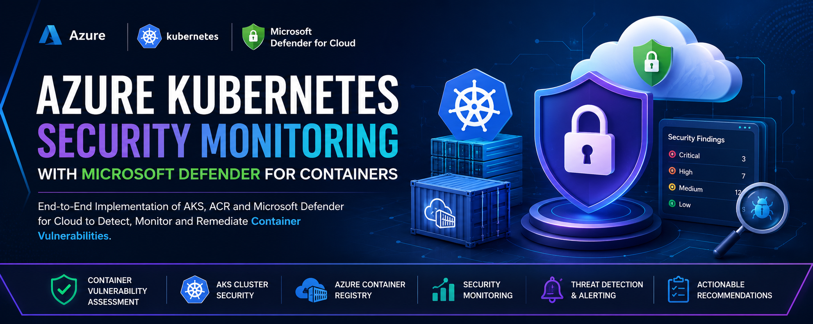
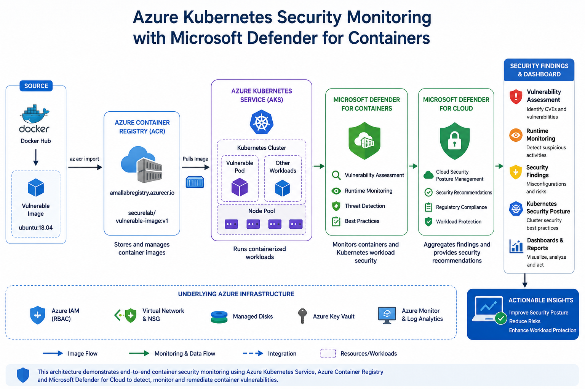
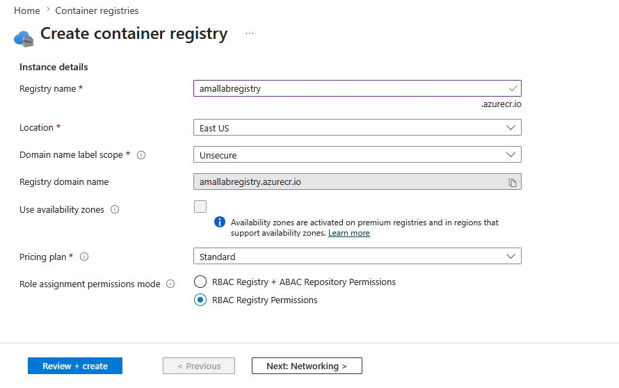
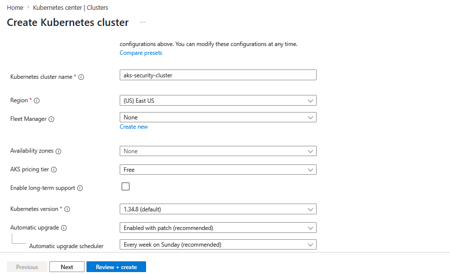
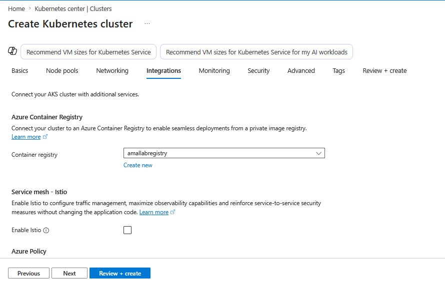
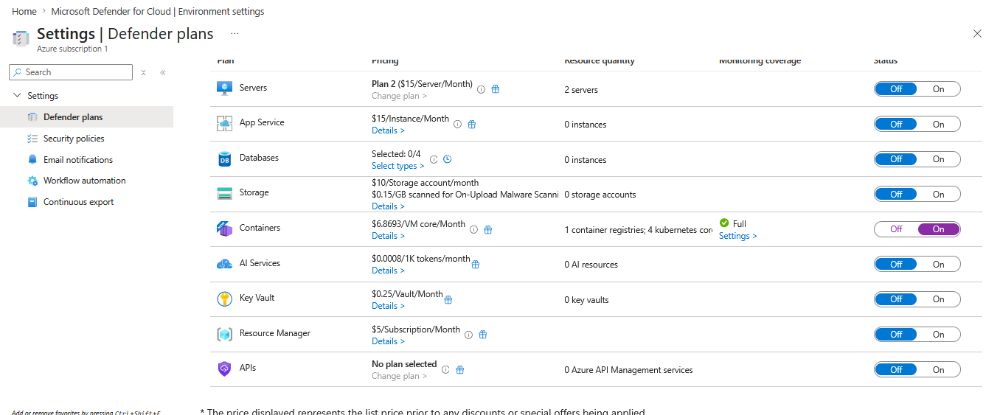
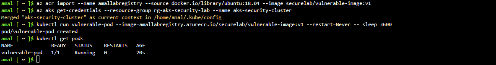
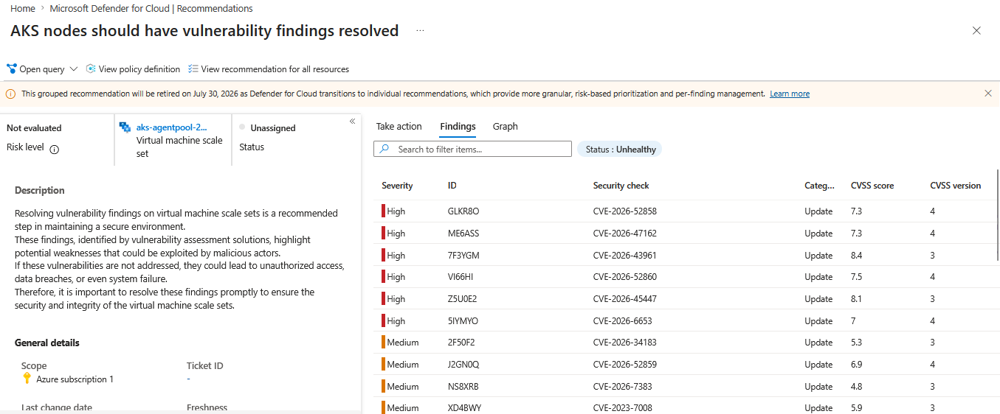
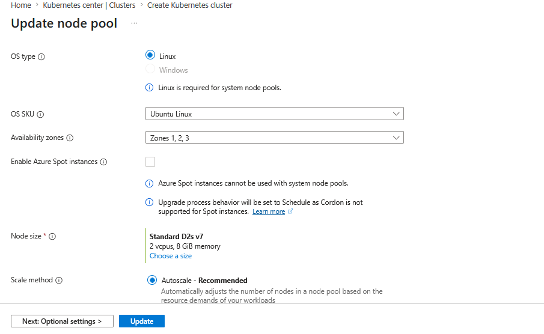

# 🛡️ Azure Kubernetes Security Monitoring with Microsoft Defender for Containers

<p align="center">
  
  
  
  
  
</p>

---

# 🚀 Project Banner

> 📌 **Insert Banner Image Here**

```markdown

```

---

## 📖 Project Overview

Containerized workloads introduce new attack surfaces that require continuous monitoring and security assessment. Microsoft Defender for Containers provides cloud-native protection for Kubernetes environments by identifying vulnerabilities, monitoring runtime activity, and improving overall security posture.

This project demonstrates how Azure Kubernetes Service (AKS), Azure Container Registry (ACR), and Microsoft Defender for Cloud can be integrated to detect and analyze vulnerable container workloads.

---

## 🎯 Project Objectives

* Deploy Azure Container Registry (ACR)
* Create Azure Kubernetes Service (AKS) Cluster
* Integrate ACR with AKS
* Enable Microsoft Defender for Containers
* Deploy Vulnerable Container Images
* Analyze Security Findings
* Implement Cloud-Native Container Security Monitoring

---

# 🏗️ Solution Architecture

> 📌 **Insert Architecture Diagram Here**

```markdown

```

### Architecture Flow

```text
Azure Container Registry (ACR)
                │
                ▼
Azure Kubernetes Service (AKS)
                │
                ▼
Microsoft Defender for Containers
                │
        ┌───────┼─────────┐
        ▼       ▼         ▼
 Vulnerability Runtime  Security
 Assessment  Analysis Findings
                │
                ▼
 Security Recommendations
```

---

# ⚙️ Technologies Used

| Technology                        | Purpose                  |
| --------------------------------- | ------------------------ |
| Azure Kubernetes Service (AKS)    | Container Orchestration  |
| Azure Container Registry (ACR)    | Container Image Storage  |
| Microsoft Defender for Cloud      | Security Monitoring      |
| Microsoft Defender for Containers | Vulnerability Assessment |
| Azure Cloud Shell                 | Deployment & Management  |
| Kubernetes                        | Container Management     |

---

# 🚀 Implementation Steps

## 1️⃣ Azure Container Registry Creation

Azure Container Registry was deployed to securely host container images used within the Kubernetes environment.

📷 **Screenshot**

```markdown

```

---

## 2️⃣ Azure Kubernetes Service (AKS) Deployment

An AKS cluster was created to host and manage containerized workloads.

📷 **Screenshot**

```markdown

```

---

## 3️⃣ Integrate Azure Container Registry with AKS

The AKS cluster was connected to Azure Container Registry, enabling secure image pulls directly from ACR.

📷 **Screenshot**

```markdown

```

---

## 4️⃣ Enable Microsoft Defender for Containers

Microsoft Defender for Containers was enabled to provide vulnerability assessment, threat detection, and runtime monitoring.

📷 **Screenshot**

```markdown

```

---

## 5️⃣ Import and Deploy Vulnerable Container Image

A vulnerable Ubuntu container image was imported into Azure Container Registry and deployed to the AKS cluster.

### Import Image

```bash
az acr import \
  --name amallabregistry \
  --source docker.io/library/ubuntu:18.04 \
  --image securelab/vulnerable-image:v1
```

### Deploy Vulnerable Pod

```bash
kubectl run vulnerable-pod \
  --image=amallabregistry.azurecr.io/securelab/vulnerable-image:v1 \
  --restart=Never \
  -- sleep 3600
```

📷 **Screenshot**

```markdown

```

---

## 6️⃣ Review Security Findings

Microsoft Defender for Cloud analyzed the workload and generated container security findings.

📷 **Screenshot**

```markdown

```

### Findings Categories

* Vulnerable Container Images
* Container Security Recommendations
* Runtime Security Alerts
* Kubernetes Security Posture Findings

---

## 7️⃣ Node Pool Configuration Review

Additional node pool settings were reviewed to strengthen AKS cluster security and workload isolation.

📷 **Screenshot**

```markdown

```

---

# 🔍 Security Findings Analysis

After onboarding the AKS cluster, Microsoft Defender for Cloud continuously monitored deployed workloads and generated actionable recommendations.

### Key Observations

✅ Vulnerability assessment enabled

✅ Container security monitoring configured

✅ AKS workload visibility established

✅ Security posture recommendations generated

✅ Defender for Containers successfully integrated

---

# 🛡️ Security Concepts Demonstrated

| Feature                           | Description                        |
| --------------------------------- | ---------------------------------- |
| Microsoft Defender for Containers | Container Vulnerability Assessment |
| AKS Security                      | Kubernetes Security Monitoring     |
| Azure Container Registry          | Secure Container Image Storage     |
| Runtime Protection                | Threat Detection                   |
| Security Recommendations          | Risk Reduction Guidance            |
| Cloud Security Posture Management | Continuous Monitoring              |

---

# 🚀 Skills Demonstrated

* Azure Kubernetes Service (AKS)
* Azure Container Registry (ACR)
* Microsoft Defender for Cloud
* Microsoft Defender for Containers
* Container Security
* Vulnerability Management
* Kubernetes Security
* Cloud Security Monitoring
* Azure Security
* DevSecOps

---

# 📚 Key Learning Outcomes

This project provided hands-on experience in:

* Deploying Azure Kubernetes Service
* Integrating Azure Container Registry
* Enabling Microsoft Defender for Containers
* Deploying vulnerable container workloads
* Analyzing security findings
* Understanding Kubernetes security best practices

---

# 🔮 Future Enhancements

* Kubernetes RBAC Hardening
* Network Policies Implementation
* Runtime Threat Hunting
* Azure Policy for AKS
* Admission Controller Security
* Supply Chain Security Controls

---

# 🎓 AZ-500 Relevance

This project aligns with Microsoft Azure Security Engineer (AZ-500) exam objectives related to:

* Microsoft Defender for Cloud
* Container Security
* AKS Security
* Security Monitoring
* Vulnerability Assessment
* Cloud Workload Protection

---

# 👨‍💻 Author

## Amal Udayanga Basnayake

🎓 BSc (Hons) Cyber Security Undergraduate

☁️ Azure Security Enthusiast

🛡️ Cloud Security | Kubernetes Security | DevSecOps | AI Security

---

⭐ If you found this project useful, consider giving the repository a star.
